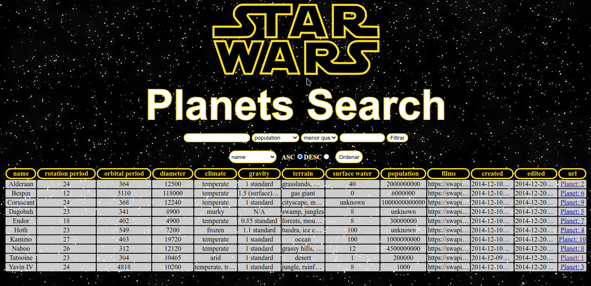

<h1 align="center">
  
</h1>

<h4 align="center"> 
  🚀 StarWars - PLANETS SEARCH 🔎🪐
</h4>

## Sobre o projeto

Essa aplicação consiste numa lista de filtros, resultando em uma tabela com planetas do universo de StarWars de acordo com as condições dos filtros somados. Também é possível ordenar os resultados pelo atributo do planeta de forma crescente ou decrescente.
As informações a serem filtradas são fornecidas por uma <a href="https://swapi-trybe.herokuapp.com/api/planets/">API</a>.

Projeto realizado como forma de avaliação. Link do repositório original ~> [ByTrybe](https://github.com/tryber/sd-010-b-project-starwars-planets-search/tree/palenske-starwars-planets-search)

## Tecnologias usadas
- React

## Habilidades desenvolvidas
- Controlar estados globais com **ContextAPI** e **Hooks**;
- Utilizar o _React Hook useState_;
- Utilizar o _React Hook useContext_;
- Utilizar o _React Hook useEffect_;
- Criar _React Hooks_ customizados.

## Como rodar a aplicação
- Faça um clone do repositório em sua máquina:
  `git clone https://github.com/palenske/frontend-project_starwars-planets-search.git`
- Entre no diretório do projeto
  `cd frontend-project_starwars-planets-search`
- Mude para a branch deste projeto:
  `git checkout palenske-starwars-planets-search`
- Instale as dependências:
  `npm install`
- Inicie a aplicação:
  `npm start`

## Explore o universo

