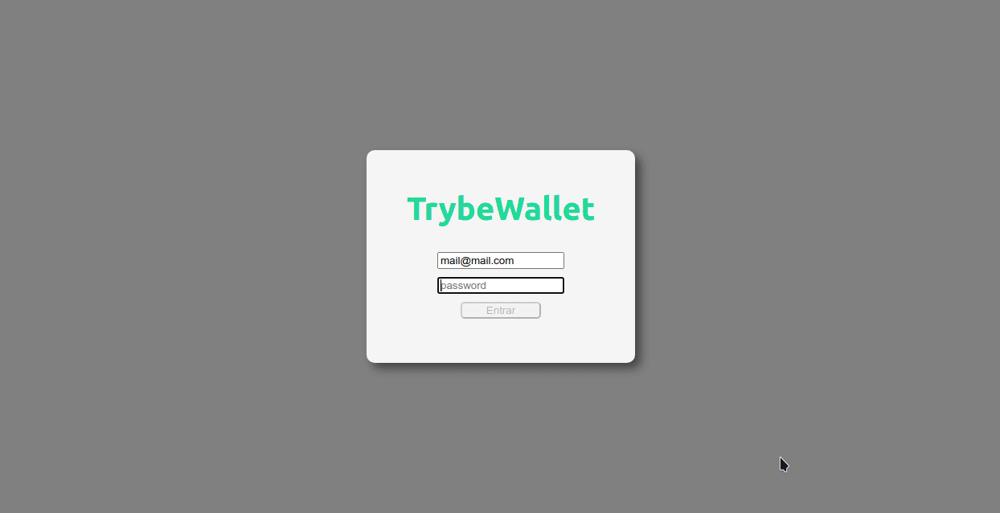

<h1 align="center">
  TrybeWallet Project
</h1>
<h4 align="center"> 
  :dollar: Gerenciamento de gastos :money_with_wings:	
</h4>

## Sobre o projeto

Essa aplicação é basicamente uma carteira de controle de gastos com conversor de moedas.
Suas principais funções são:
  - Adicionar, remover e editar um gasto;
  - Visualizar uma tabela com seus gastos;
  - Visualizar o total de gastos convertidos para uma moeda de escolha;
Para realizar a conversão de moedas, nossa aplicação consome a [API](https://economia.awesomeapi.com.br/json/all) que fornece a cotação atualizada.

Projeto realizado como forma de avaliação. Link do repositório original ~> [ByTrybe](https://github.com/tryber/sd-010-b-project-trybewallet/tree/palenske-trybewallet)

## Tecnologias usadas
- React
- Redux

## Habilidades desenvolvidas
- Controlar estados globais com **Redux**;
- Criar um store _Redux_ em aplicações _React_;
- Criar reducers no _Redux_ em aplicações _React_;
- Criar actions no _Redux_ em aplicações _React_;
- Criar dispatchers no _Redux_ em aplicações _React_
- Conectar _Redux_ aos componentes _React_
- Criar actions assíncronas na sua aplicação _React_ que faz uso de _Redux_.

## Como rodar a aplicação
- Faça um clone do repositório em sua máquina:
  `git clone https://github.com/palenske/frontend-project_trybewallet.git`
- Entre no diretório do projeto:
  `cd frontend-project_trybewallet`
- Mude para a branch deste projeto:
  `git checkout palenske-trybewallet`
- Instale as dependências:
  `npm install`
- Inicie a aplicação:
  `npm start`
> Para fazer o login na carteira, é necessário um email no formato `mail@mail.com` e uma senha de no mínimo 6 dígitos.

## Gerencie seus gastos

